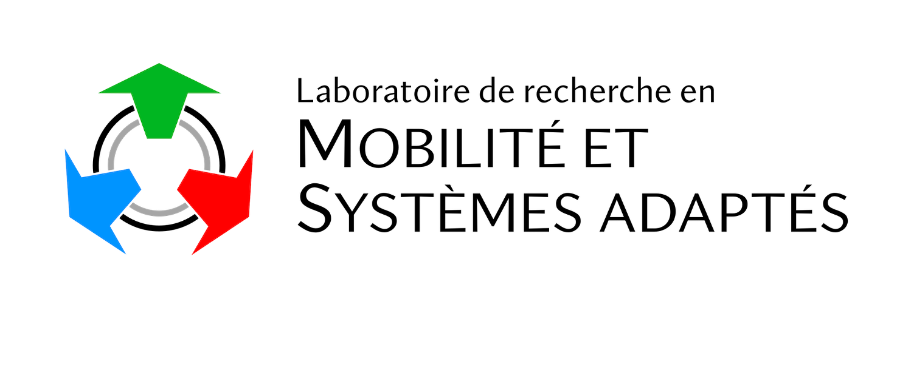
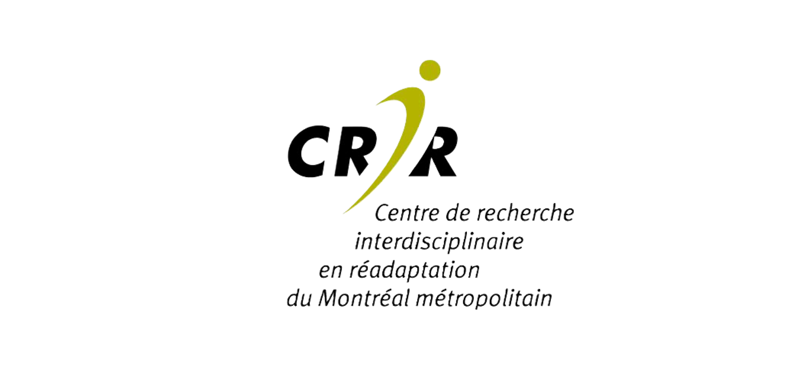

:::::{grid} 1 1 8 8

::::{grid-item}
:columns: 1

::::
::::{grid-item}
:columns: 7
The Kinetics Toolkit project provides the open-source Python package [kineticstoolkit](https://kineticstoolkit.uqam.ca/docs/api) to facilitate research in biomechanics. It includes tools for analyzing time series (e.g., filtering, segmenting, splitting, resampling...); performing rigid body geometry operations, visualizing points, vectors and bodies interactively, and more.
::::

::::{grid-item}
:columns: 1

::::
::::{grid-item}
:columns: 7
Since programming can be hard for new users, Kinetics Toolkit also provides a complete [reference book](https://kineticstoolkit.uqam.ca/docs/book), which covers the Python programming language, Matplotlib, NumPy, and all the features of the kineticstoolkit package, with reproducible examples based on real, downloadable data.
::::
:::::

[Jump to the book to get started!](https://kineticstoolkit.uqam.ca/docs/book)

-----------------

:::::{grid} 1 1 3 3
::::{grid-item}

::::
::::{grid-item}

::::
::::{grid-item}

::::
:::::
